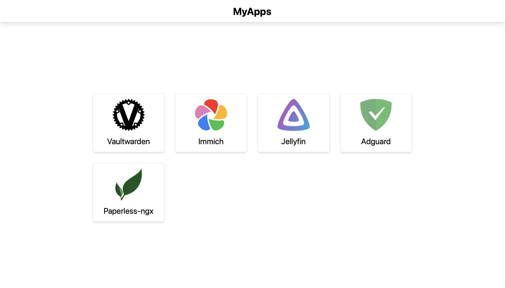

# Bookmark

[](./LICENSE)
[](https://svelte.dev/)
[](https://www.docker.com/)


A simple self-hosted dashboard for homelab bookmarks.

Bookmark displays only the apps that the current user is allowed to access, based on their assigned roles.



## Features

- Simple bookmark dashboard
- Role-based app visibility
- Configuration through a single YAML file
- Built-in basic authentication
- Docker and Docker Compose support
- Optional custom icons

## Tech stack

Bookmark is built with a lightweight and self-hosting-friendly stack:

| Technology     |    Version |
|----------------|-----------:|
| **Node.js**    |    `24.14` |
| **Svelte**     |     `5.55` |
| **SvelteKit**  |     `2.57` |
| **Vite**       |      `8.0` |
| **TypeScript** |      `6.0` |

This stack keeps Bookmark simple to deploy, easy to maintain, and approachable for contributors.

## Why Bookmark?

Bookmark was created for homelab users who want a simple entry point to all their other applications.

Many dashboards are powerful,
but they can also become complex when all you need is a list of links with basic access control.
Bookmark keeps the scope intentionally small: define your apps, define your users, assign roles,
and each user only sees what they are allowed to access.

No database is required. No complex setup is needed. Everything is configured from a single YAML file.

Bookmark is designed to be:

- Simple to deploy
- Easy to understand
- Lightweight to run
- Role-aware by default
- Friendly to Docker and reverse proxy setups

The goal is not to be the most feature-rich homelab dashboard.
The goal is to be the dashboard that does one thing well: showing the right bookmarks to the right users.

## Usage

### Configuration file

Create a `config.yaml` file:

```yaml
# config.yaml
title: MyBookmarks
description: My apps are awesome
auth: basic_auth
apps:
  - id: app_1
    name: App 1
    url: https://app1.yourdomain.org
    roles:
      - admin

users:
  - username: your_user
    password: "{your_hashed_password}"
    roles:
      - admin
```

#### Title and description

The `title` and `description` fields are used by the page template.

They define the page title and description metadata, which can be displayed by the browser or link previews.

Example:

```yaml
title: MyBookmarks
description: My personal homelab dashboard
```

#### auth

The auth field defines the authentication method.
Currently, the only supported value is `basic_auth`

OpenID Connect and Forward Auth support are planned,
so Bookmark can integrate with services such as Authelia or Authentik.

#### apps

The apps section defines the bookmarks displayed in the dashboard.
Each app requires:

| Field   | Required | Description                                              |
|---------|---------:|----------------------------------------------------------|
| `id`    |      Yes | Unique app identifier. Also used as the default icon ID. |
| `name`  |      Yes | Display name of the app.                                 |
| `url`   |      Yes | URL where the user will be redirected.                   |
| `roles` |      Yes | List of roles allowed to see this app.                   |
| `icon`  |       No | Custom icon ID. See [Icons](#icons).                     |

Example:

```yaml
apps:
  - id: jellyfin
    name: Jellyfin
    url: https://jellyfin.yourdomain.org
    roles:
      - admin
      - media
```

#### users

The users section defines who can access Bookmark.

Each user requires:

| Field      | Required | Description                                             |
|------------|---------:|---------------------------------------------------------|
| `username` |      Yes | Username used to sign in.                               |
| `password` |      Yes | Hashed password. See [Hash passwords](#hash-passwords). |
| `roles`    |      Yes | List of roles assigned to the user.                     |

Example:
```yaml
users:
  - username: alice
    password: "$2b$..."
    roles:
      - admin
      - media
```

### Docker compose

#### Basic example
```yaml
# compose.yaml
---
name: bookmark

services:
  bookmark:
    container_name: bookmark
    image: codeberg.org/huskas-2189/bookmark:latest
    environment:
      BOOKMARK_ORIGIN: "http://localhost:3000"
    ports:
      - "3000:3000"
    volumes:
      - ./config.yaml:/config.yaml:ro
```

Start the service:
```bash
docker compose up -d
```

Then open http://localhost:3000

#### Traefik example
```yaml
# compose.yaml
---
name: bookmark

services:
  bookmark:
    container_name: bookmark
    image: codeberg.org/huskas-2189/bookmark:latest
    environment:
      BOOKMARK_ORIGIN: "https://bookmark.domain.org"
    networks:
      - traefik
    volumes:
      - ./config.yaml:/config.yaml:ro
    labels:
      - "traefik.enable=true"
      - "traefik.docker.network=traefik"
      - "traefik.http.routers.bookmark.service=bookmark-service"
      - "traefik.http.routers.bookmark.rule=Host(`bookmark.domain.org`)"
      - "traefik.http.services.bookmark-service.loadbalancer.server.port=3000"
      - "traefik.http.services.bookmark-service.loadbalancer.server.scheme=http"

networks:
  traefik:
    external: true
```

Make sure **BOOKMARK_ORIGIN** matches the public URL used to access the app.

#### Environment variables

List of available environment variables:

| Env             | Default Value         |
|-----------------|-----------------------|
| BOOKMARK_ORIGIN | http://localhost:3000 |
| CONFIG_FILE     | /config.yaml          |


### Hash Passwords

Passwords must be hashed before being added to `config.yaml`.

Run:
`docker run --rm codeberg.org/huskas-2189/bookmark:latest npm run hash-password -- {your_very_strong_password}`

Then copy the generated hash into your configuration file:

```yaml
users:
  - username: your_user
    password: "{generated_hash}"
    roles:
      - admin
```

**Do not store plain-text passwords in config.yaml.**

### Icons

Icons are provided by [Homarr-labs](https://github.com/homarr-labs/homarr).
By default, Bookmark tries to use the app `id` as the icon ID.

If the icon does not exist, or if you want to use a different icon, add the icon field:
```yaml
apps:
  - id: my-media-server
    name: Jellyfin
    icon: jellyfin
    url: https://jellyfin.yourdomain.org
    roles:
      - media
```

## Roadmap

The roadmap is managed in the [`Roadmap` project](https://codeberg.org/huskas-2189/Bookmark/projects/49784).

The current development priorities are:

- Forward Auth support
- OpenID Connect authentication
- Healthcheck endpoint
- Built-in Traefik labels support

Ideas, issues, and contributions are welcome.

## AI usage

AI tools were used as development assistance while building Bookmark.

They helped with algorithm-related advice, understanding Svelte concepts
and features as someone coming from a PHP background,
and learning how to use Codeberg Actions after working mostly with GitLab.

AI was also used for translations, documentation improvements, and writing parts of this README.

## License

This project is licensed under the **GNU General Public License v3.0**.

See the [`LICENSE`](./LICENSE) file for details.
